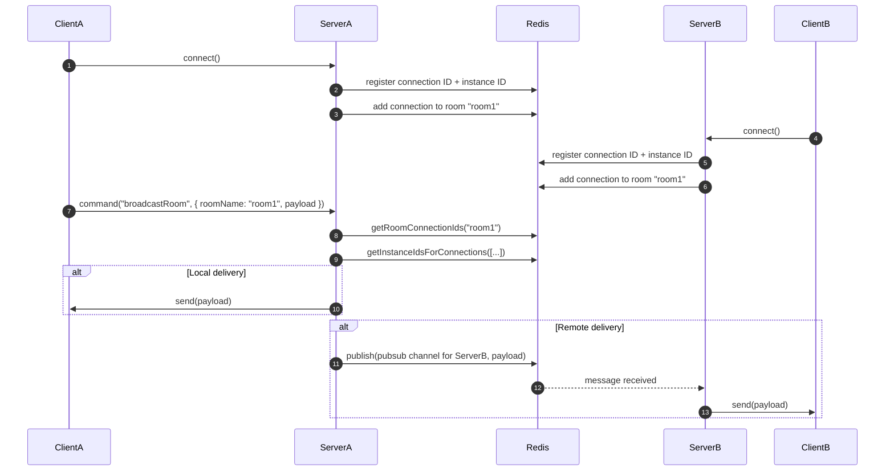

# mesh

Mesh is a command-based WebSocket server and client framework designed for scalable, multi-instance deployments. It uses Redis to coordinate connections, rooms, and metadata across servers, enabling reliable horizontal scaling. Mesh includes built-in ping/latency tracking, automatic reconnection, and a simple command API for clean, asynchronous, RPC-like communication.

* [Quickstart](#quickstart)
  * [Server](#server)
  * [Client](#client)
* [Distributed Messaging Architecture](#distributed-messaging-architecture)
  * [Redis Channel Subscriptions](#redis-channel-subscriptions)
    * [Server Configuration](#server-configuration)
    * [Server Publishing](#server-publishing)
    * [Client Usage](#client-usage)
  * [Metadata](#metadata)
  * [Room Metadata](#room-metadata)
* [Record Subscriptions](#record-subscriptions)
  * [Server Configuration](#server-configuration-1)
  * [Updating Records](#updating-records)
  * [Client Usage — Full Mode (default)](#client-usage--full-mode-default)
  * [Client Usage — Patch Mode](#client-usage--patch-mode)
  * [Unsubscribing](#unsubscribing)
  * [Versioning and Resync](#versioning-and-resync)
* [Command Middleware](#command-middleware)
* [Latency Tracking and Connection Liveness](#latency-tracking-and-connection-liveness)
  * [Server-Side Configuration](#server-side-configuration)
  * [Client-Side Configuration](#client-side-configuration)
* [Comparison](#comparison)

## Quickstart

### Server

```ts
import { MeshServer } from "@prsm/mesh/server";

const server = new MeshServer({
  port: 8080,
  redisOptions: { host: "localhost", port: 6379 },
});

server.registerCommand("echo", async (ctx) => {
  return `echo: ${ctx.payload}`;
});

server.registerCommand("this-command-throws", async (ctx) => {
  throw new Error("Something went wrong");
});

server.registerCommand("join-room", async (ctx) => {
  const { roomName } = ctx.payload;
  await server.addToRoom(roomName, ctx.connection);
  await server.broadcastRoom(roomName, "user-joined", {
    roomName,
    id: ctx.connection.id,
  });
  return { success: true };
});

server.registerCommand("broadcast", async (ctx) => {
  server.broadcast("announcement", ctx.payload);
  return { sent: true };
});
```

### Client

```ts
import { MeshClient } from "@prsm/mesh/client";

const client = new MeshClient("ws://localhost:8080");
await client.connect();

{
  const response = await client.command("echo", "Hello, world!");
  console.log(response); // echo: Hello, world!
}

{
  // Or use the synchronous version which blocks the event loop
  // until the command is completed.
  const response = client.commandSync("echo", "Hello, world!");
  console.log(response); // echo: Hello, world!
}

{
  const response = await client.command("this-command-throws");
  console.log(response); // { error: "Something went wrong" }
}

{
  const response = await client.command("join-room", { roomName: "lobby" });
  console.log(response); // { success: true }
}

client.on("latency", (event) => {
  console.log(`Latency: ${event.detail.latency}ms`);
});

client.on("user-joined", (event) => {
  console.log(`User ${event.detail.id} joined ${event.detail.roomName}`);
});

await client.close();
```

## Distributed Messaging Architecture

The diagram below illustrates how Mesh handles communication across multiple server instances. It uses Redis to look up which connections belong to a room, determine their host instances, and routes messages accordingly — either locally or via pub/sub.



### Redis Channel Subscriptions

Mesh lets clients subscribe to Redis pub/sub channels and receive messages directly over their WebSocket connection. When subscribing, clients can optionally request recent message history.

#### Server Configuration

Expose the channels you want to allow subscriptions to:

```ts
server.exposeChannel("notifications:global");
server.exposeChannel(/^chat:.+$/);

// return false to disallow subscription, or true to allow
server.exposeChannel(/^private:chat:.+$/, async (conn, channel) => {
  // per-client guarding
  const valid = await isPremiumUser(conn);
  return valid;
});
```

#### Server Publishing

To publish messages to a channel (which subscribed clients will receive), use the `publishToChannel` method. You can optionally store a history of recent messages in Redis.

```ts
// publish to 'notifications:global' without history
await server.publishToChannel(
  "notifications:global",
  JSON.stringify({ alert: "Red alert!" })
);

// publish a chat message and keep the last 50 messages in history
await server.publishToChannel(
  "chat:room1",
  JSON.stringify({ type: "user-message", user: "1", text: "Hi" }),
  50 // store in Redis history
);
```

The `history` parameter tells Mesh to store the message in a Redis list (`history:<channel>`) and trim the list to the specified size, ensuring only the most recent messages are kept. Clients subscribing with the `historyLimit` option will receive these historical messages upon connection.

#### Client Usage

```ts
const { success, history } = await client.subscribe(
  "chat:room1",
  (message) => {
    console.log("Live message:", message);
  },
  { historyLimit: 3 }
);

if (success) {
  console.log("Recent messages:", history); // ["msg3", "msg2", "msg1"]
}
```

Unsubscribe when no longer needed:

```ts
await client.unsubscribe("chat:room1");
```

This feature is great for:

- Real-time chat and collaboration
- Live system dashboards
- Cross-instance pub/sub messaging
- Notification feeds with instant context

### Metadata

You can associate data like user IDs, tokens, or custom attributes with a connection using the `setMetadata` method. This metadata is stored in Redis and accessible from any server instance, making it ideal for identifying users, managing permissions, or persisting session-related data across distributed deployments.

Metadata is stored in Redis, so it can be safely accessed from any instance of your server.

```ts
server.registerCommand("authenticate", async (ctx) => {
  // maybe do some actual authentication here
  const { userId } = ctx.payload;
  const token = encode({
    sub: userId,
    iat: Date.now(),
    exp: Date.now() + 3600,
  });

  await server.connectionManager.setMetadata(ctx.connection, {
    userId,
    token,
  });

  return { success: true };
});
```

Get metadata for a specific connection:

```ts
const metadata = await server.connectionManager.getMetadata(connectionId);
// { userId, token }
```

Get all metadata for all connections:

```ts
const metadata = await server.connectionManager.getAllMetadata();
// [{ [connectionId]: { userId, token } }, ...]
```

Get all metadata for all connections in a specific room:

```ts
const metadata = await server.connectionManager.getAllMetadataForRoom(roomName);
// [{ [connectionId]: { userId, token } }, ...]
```

### Room Metadata

Similar to connection metadata, Mesh allows you to associate arbitrary data with rooms. This is useful for storing room-specific information like topics, settings, or ownership details. Room metadata is also stored in Redis and accessible across all server instances.

```ts
// set metadata for a room
await server.roomManager.setMetadata("lobby", {
  topic: "General Discussion",
  maxUsers: 50,
});

// get metadata for a specific room
const lobbyMeta = await server.roomManager.getMetadata("lobby");
// { topic: "General Discussion", maxUsers: 50 }

// update metadata (merges with existing data)
await server.roomManager.updateMetadata("lobby", {
  topic: "Updated Topic", // Overwrites existing topic
  private: false, // Adds new field
});

const updatedLobbyMeta = await server.roomManager.getMetadata("lobby");
// { topic: "Updated Topic", maxUsers: 50, private: false }

// get metadata for all rooms
const allRoomMeta = await server.roomManager.getAllMetadata();
// { lobby: { topic: "Updated Topic", maxUsers: 50, private: false }, otherRoom: { ... } }
```

Room metadata is removed when `clearRoom(roomName)` is called.

## Record Subscriptions

Mesh supports subscribing to individual records stored in Redis. When a record changes, clients receive either the full value or a JSON patch describing the update—depending on the selected mode (`full` or `patch`).

Subscriptions are multi-instance aware, versioned for integrity, and efficient at scale. Each connected client can independently choose its preferred mode.

### Server Configuration

Expose records using exact IDs or regex patterns. You can add optional per-client guard logic:

```ts
server.exposeRecord("user:123");

server.exposeRecord(/^product:\d+$/);

server.exposeRecord(/^private:.+$/, async (conn, recordId) => {
  const meta = await server.connectionManager.getMetadata(conn);
  return !!meta?.userId;
});
```

### Updating Records

Use `publishRecordUpdate()` to update the stored value, increment the version, generate a patch, and broadcast to all subscribed clients.

```ts
await server.publishRecordUpdate("user:123", {
  name: "Alice",
  email: "alice@example.com",
});

// later...
await server.publishRecordUpdate("user:123", {
  name: "Alice",
  email: "alice@updated.com",
  status: "active",
});
```

### Client Usage — Full Mode (default)

In `full` mode, the client receives the entire updated record every time. This is simpler to use and ideal for small records or when patching isn't needed.

```ts
let userProfile = {};

const { success, record, version } = await client.subscribeRecord(
  "user:123",
  (update) => {
    userProfile = update.full;
    console.log(`Received full update v${update.version}:`, update.full);
  }
);

if (success) {
  userProfile = record;
}
```

### Client Usage — Patch Mode

In `patch` mode, the client receives only changes as JSON patches and must apply them locally. This is especially useful for large records that only change in small ways over time.

```ts
import { applyPatch } from "@prsm/mesh/client";

let productData = {};

const { success, record, version } = await client.subscribeRecord(
  "product:456",
  (update) => {
    if (update.patch) {
      // normally you’ll receive `patch`, but if the client falls out of sync,
      // the server will send a full update instead to resynchronize.
      applyPatch(productData, update.patch);
      console.log(`Applied patch v${update.version}`);
    } else {
      productData = update.full;
      console.log(`Received full (resync) v${update.version}`);
    }
  },
  { mode: "patch" }
);

if (success) {
  productData = record;
}
```

### Unsubscribing

```ts
await client.unsubscribeRecord("user:123");
await client.unsubscribeRecord("product:456");
```

### Versioning and Resync

Every update includes a `version`. Clients should track the current version and, in `patch` mode, expect `version === localVersion + 1`. If a gap is detected (missed patch), the client will automatically be sent a full record update to resync.

This system allows fine-grained, real-time synchronization of distributed state with minimal overhead.

## Command Middleware

Mesh allows you to define middleware functions that run before your command handlers. This is useful for tasks like authentication, validation, logging, or modifying the context before the main command logic executes.

Middleware can be applied globally to all commands or specifically to individual commands.

**Global Middleware:**

Applied to every command received by the server.

```ts
server.addMiddleware(async (ctx) => {
  console.log(`Received command: ${ctx.command} from ${ctx.connection.id}`);
});

server.addMiddleware(async (ctx) => {
  const metadata = await server.connectionManager.getMetadata(ctx.connection);
  if (!metadata?.userId) {
    throw new Error("Unauthorized");
  }

  // add to context for downstream handler access
  ctx.user = { id: metadata.userId };
});
```

**Command-Specific Middleware:**

Applied only to the specified command, running _after_ any global middleware.

```ts
const validateProfileUpdate = async (ctx) => {
  const { name, email } = ctx.payload;
  if (typeof name !== "string" || name.length === 0) {
    throw new Error("Invalid name");
  }
  if (typeof email !== "string" || !email.includes("@")) {
    throw new Error("Invalid email");
  }
};

server.registerCommand(
  "update-profile",
  async (ctx) => {
    // ..
    return { success: true };
  },
  [validateProfileUpdate]
);
```

Middleware functions receive the same `MeshContext` object as command handlers and can be asynchronous. If a middleware function throws an error, the execution chain stops, and the error is sent back to the client.

## Latency Tracking and Connection Liveness

Mesh includes a built-in ping/pong system to track latency and detect dead connections. This is implemented at the _application level_ (not via raw WebSocket protocol `ping()` frames) to allow for:

- Accurate latency measurement from server to client.
- Graceful connection closure and multi-instance Redis cleanup.
- Fine-tuned control using configurable missed ping/pong thresholds.

### Server-Side Configuration

By default, the server sends periodic `ping` commands. Clients respond with `pong`. If the server misses more than `maxMissedPongs` consecutive responses, the connection is considered stale and is closed cleanly. This ensures all connection metadata and room membership are safely cleaned up across distributed instances.

You can configure the server like so:

```ts
const server = new MeshServer({
  port: 8080,
  redisOptions: { host: "localhost", port: 6379 },
  pingInterval: 30000, // ms between ping commands
  latencyInterval: 5000, // ms between latency checks
  maxMissedPongs: 1, // how many consecutive pongs can be missed before closing (default: 1)
});
```

With the default `maxMissedPongs` value of 1, a client has roughly 2 \* pingInterval time to respond before being disconnected.

### Client-Side Configuration

On the client, Mesh automatically handles incoming `ping` commands by responding with a `pong`, and resets its internal missed pings counter. If the server stops sending `ping` messages (e.g. due to a dropped connection), the client will increment its missed pings counter. Once the counter exceeds `maxMissedPings`, the client will attempt to reconnect if `shouldReconnect` is enabled.

Client-side configuration looks like this:

```ts
const client = new MeshClient("ws://localhost:8080", {
  pingTimeout: 30000, // ms between ping timeout checks
  maxMissedPings: 1, // how many consecutive pings can be missed before reconnecting (default: 1)
  shouldReconnect: true, // auto-reconnect when connection is lost
  reconnectInterval: 2000, // ms between reconnection attempts
  maxReconnectAttempts: 5, // give up after 5 tries (or Infinity by default)
});
```

Together, this system provides end-to-end connection liveness guarantees without relying on low-level WebSocket protocol `ping`/`pong` frames, which do not offer cross-instance cleanup or latency tracking. The configurable thresholds on both sides allow for fine-tuning the balance between responsiveness and tolerance for network latency.

## Comparison

|                          | **Mesh**                 | Socket.IO                       | Colyseus            | Deepstream.io   | ws (+ custom)        | uWebSockets.js          |
| ------------------------ | ------------------------ | ------------------------------- | ------------------- | --------------- | -------------------- | ----------------------- |
| **Command API (RPC)**    | ✅                       | ❌                              | ✅                  | ✅              | ❌                   | ❌                      |
| **Raw Events Support**   | ✅                       | ✅                              | ⚠️ Limited          | ✅              | ✅                   | ✅                      |
| **Room Support**         | ✅                       | ✅                              | ✅                  | ✅              | ⚠️ DIY               | ⚠️ Manual               |
| **Redis Scaling**        | ✅ Native                | ✅ With adapter                 | ✅                  | ✅              | ✅ If added          | ❌                      |
| **Connection Metadata**  | ✅ Redis-backed          | ⚠️ Manual                       | ⚠️ Limited          | ✅ Records      | ❌                   | ❌                      |
| **Latency Tracking**     | ✅ Built-in              | ⚠️ Manual                       | ❌                  | ❌              | ❌                   | ❌                      |
| **Automatic Reconnect**  | ✅                       | ✅                              | ✅                  | ✅              | ❌                   | ❌                      |
| **Redis Pub/Sub**        | ✅ Client subscription   | ⚠️ Server-side only             | ❌                  | ✅              | ❌                   | ❌                      |
| **History on Subscribe** | ✅ Optional Redis-backed | ❌                              | ❌                  | ⚠️ Streams only | ⚠️ DIY               | ❌                      |
| **Record Subscriptions** | ✅ Versioned + Patchable | ❌                              | ❌                  | ⚠️ Raw records  | ❌                   | ❌                      |
| **Typescript-First**     | ✅ Yes, mostly           | ⚠️ Mixed                        | ✅                  | ⚠️              | ⚠️                   | ❌                      |
| **Scalability**          | ✅ Horizontal via Redis  | ✅ Horizontal via Redis Adapter | ✅                  | ✅              | ⚠️ Manual            | ✅ But no sync          |
| **Target Use Case**      | Real-time/generic async  | Real-time apps, chat            | Multiplayer games   | Pub/Sub, IoT    | Anything (low-level) | Anything (perf-focused) |
| **Ease of Use**          | ✅ Minimal API           | ⚠️ Event-centric                | ⚠️ More boilerplate | ⚠️ More config  | ⚠️ DIY               | ⚠️ Very low-level       |
